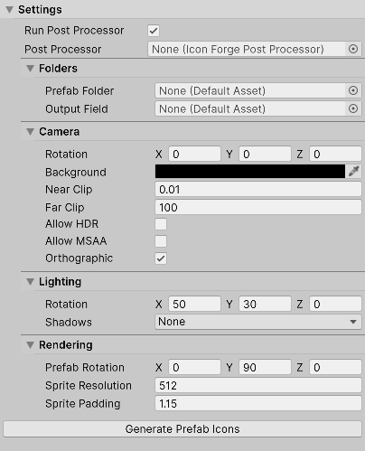

# Unity Icon Forge

Generate high-quality PNG icons directly from your prefabs, batch render 100+ UI icons in just a few clicks.

## Features

- Built using UI Toolkit for a modern editor experience.
- Customizable camera, lighting, and render settings.
- Batch rendering support - generate 100+ icons in one click.
- Post-processing hooks to run custom logic on generated files.
- Designed for UI-heavy workflows and production pipelines.

## Getting Started

### Install via Unity Package

Download the latest release from the [releases page](https://github.com/danielpokladek/icon-forge/releases) and import it into your project like any Unity package.

### Install via Repository Clone

Clone this repository and copy contents of `Assets/Plugins/IconForge/` into your project.

Open the tool from `Tools -> IconForge`.

## Contributing

Contributions are what make the open source community an amazing place to learn, inspire, and create. Any contributions you make are greatly appreciated.

If you have a suggestion that would make this project better, please fork the repo and create a pull request. You can also simply open an issue with the relevant tag. Don't forget to give the project a star! Thank you! ❤️

## Releases

Visit [RELEASES](https://github.com/danielpokladek/icon-forge/releases) to see previous releases, changelog, and the latest release.

## License

Distributed under the MIT License. See [LICENSE](./LICENSE) for more information.
